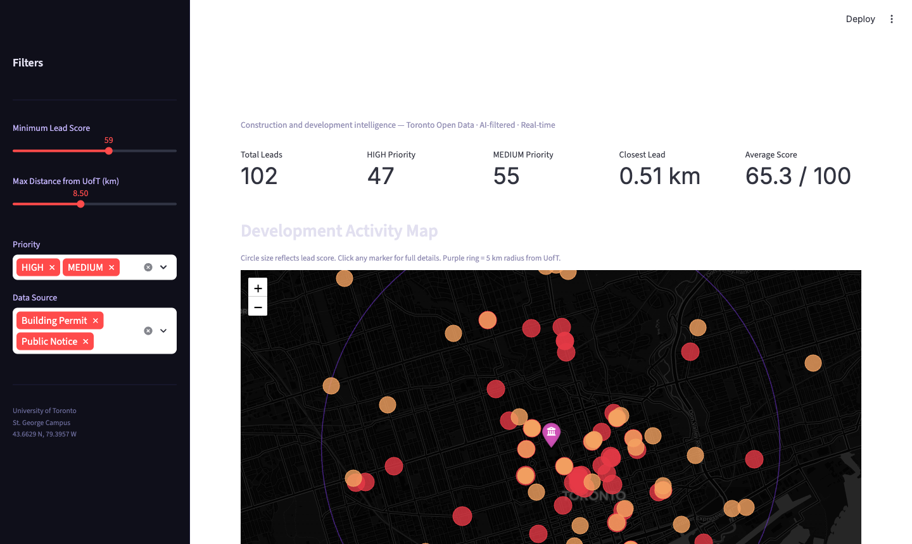

# Mercator AI — Toronto Construction Intelligence

A production-style ETL pipeline and analytics dashboard that ingests real municipal data from the City of Toronto, applies AI-powered filtering and lead scoring, and surfaces the most actionable construction and development leads for the University of Toronto's business development team.

---

## Dashboard Preview



---

## Data Sources

Three real data sources are ingested on every pipeline run. No synthetic or fabricated data is used.

### 1. Toronto Building Permits — Toronto Open Data (CKAN API)

- **Endpoint:** `https://ckan0.cf.opendata.inter.prod-toronto.ca/api/3/action/datastore_search`
- **Datasets:** `building-permits-active-permits`, `building-permits-cleared-permits`
- **Volume:** 2,000 records per dataset (4,000 total)
- **Key fields:** permit number, permit type, work description, street address, application date, issued date, completed date, estimated construction cost, current use, proposed use, dwelling units
- **Limitation:** The CKAN API does not expose lat/lon for permit records, so geospatial distance scoring is not available for this source

### 2. Toronto Public Notices — City of Toronto Notices API

- **Endpoint:** `https://secure.toronto.ca/nm/notices.json`
- **Volume:** ~2,561 live notices; ~2,240 within 20 km of UofT after geospatial filter; ~1,254 after AI relevance filter
- **Key fields:** notice ID, title, notice date, decision body, planning application numbers, topics, full address, `latitudeCoordinate`, `longitudeCoordinate`
- **Note:** The endpoint returns a `{"TotalRecordCount": N, "Records": [...]}` envelope. It uses streaming HTTP due to the ~19 MB response size.

### 3. Toronto Development Applications — Toronto Open Data (CKAN API)

- **Endpoint:** `https://ckan0.cf.opendata.inter.prod-toronto.ca/api/3/action/datastore_search`
- **Resource ID:** `8907d8ed-c515-4ce9-b674-9f8c6eefcf0d`
- **Volume:** 2,000 records (26,194 total available, paginated)
- **Key fields:** application type, address, status, date submitted, description, ward, `X` and `Y` coordinates
- **Coordinate system:** X/Y are in NAD27 / MTM Zone 10 (EPSG:2019) and are converted to WGS84 lat/lon using pyproj

---

## Tech Stack

| Layer | Technology | Purpose |
|-------|-----------|---------|
| Orchestration | Python 3.11 | Pipeline runner, ETL coordination |
| HTTP / Ingestion | `requests` (streaming) | API calls, handles slow servers via `stream=True` |
| Data storage | Apache Parquet | Columnar raw and processed data on disk |
| Analytical warehouse | DuckDB | In-process SQL analytical engine, replaces BigQuery |
| Geospatial | `pyproj` (EPSG:2019 to 4326) | Coordinate system conversion (MTM to WGS84) |
| Geospatial distance | Haversine formula | Great-circle distance from UofT to each lead |
| AI filtering | Google Gemini 2.5 Flash | Batch notice relevance classification |
| Frontend | Streamlit + Folium | Interactive map dashboard |
| Workflow blueprint | Apache Airflow (DAG) | Production scheduling template |

---

## ETL Pipeline

The pipeline runs in four sequential stages: Extract, Transform, Load, Analyse.

### Stage 1 — Extract (`extract.py`)

**Building Permits**
The CKAN `package_show` API is called to discover resource IDs for both the active and cleared permits datasets. For each dataset, the `datastore_search` endpoint is paginated in batches of 1,000 until 2,000 records are retrieved. Records are concatenated and saved as `data/raw/building_permits_raw.parquet`.

**Public Notices**
The Toronto Notices API returns a large (~19 MB) JSON response. The request uses `stream=True` to avoid timeout failures on the slow municipal server. The response envelope (`{"Records": [...]}`) is parsed to extract the notices list. Each notice's address block uses `latitudeCoordinate` and `longitudeCoordinate` field names. Saved as `data/raw/public_notices_raw.parquet`.

**Development Applications**
The CKAN datastore is queried directly using the hardcoded resource ID for the development applications dataset. Results include `X` and `Y` columns in NAD27/MTM Zone 10 projection. Saved as `data/raw/dev_applications_raw.parquet`.

---

### Stage 2 — Transform (`transform.py`)

**Schema Normalisation**
Column names are lowercased and standardised across sources. A deduplication step (`df.loc[:, ~df.columns.duplicated()]`) removes duplicate columns that arise when multiple source field names map to the same target.

**Coordinate Conversion**
Development application X/Y values (NAD27 / MTM Zone 10, EPSG:2019) are converted to WGS84 decimal degrees using `pyproj.Transformer`. A sanity check validates output coordinates fall within Toronto's bounding box (lat 43.4–44.0, lon -80.0 to -78.8) to reject nulls and outliers. Of 2,000 records, ~1,959 geocode successfully.

**Geospatial Enrichment**
Every record with valid lat/lon is assigned a `distance_from_uoft_km` value computed using the Haversine formula against the UofT St. George campus centroid (43.6629 N, 79.3957 W). Records beyond 20 km are dropped.

**AI Notice Filtering (Gemini 2.5 Flash)**
After the geospatial filter, the 2,240 remaining notices are sent to Google Gemini 2.5 Flash in batches of 20. Each batch contains notice titles and the first 200 characters of the description. Gemini classifies each as `RELEVANT` or `SKIP`:

- **RELEVANT:** Construction, demolition, rezoning (OPA/ZBA), site plan approval, draft plan of subdivision, consent to sever, minor variance for intensification — any signal of an upcoming physical change to a property
- **SKIP:** Heritage designation (freezes the property), street or park renaming, noise exemption permits, procedural or administrative matters, awards, public art

Results are cached in `data/processed/notices_gemini_classified.parquet`. On subsequent pipeline runs, only new notice IDs are sent to the API. Already-classified notices are read from cache, making re-runs faster and cheaper.

The filter retains approximately 1,254 of 2,240 notices (56%), removing ~986 non-development notices.

**Project Stage Classification**
A rule-based classifier assigns each record a lifecycle stage. For permits, stage is derived from `status`, `issued_date`, and `completed_date`. For notices, stage is derived from the planning topic field (zoning amendment maps to Concept, site plan maps to Application, etc.).

Stages in order: `Concept, Application, Under Review, Approved, Construction, Complete`

**Lead Scoring**
Each record is scored on a 0–100 scale using four equally-weighted factors:

| Factor | Max Points | Brackets |
|--------|-----------|---------|
| Proximity | 25 | ≤1 km = 25, ≤3 km = 20, ≤5 km = 14, ≤10 km = 8, >10 km = 2 |
| Stage | 25 | Concept = 25, Application = 20, Under Review = 12, Approved = 6, Construction = 2, Complete = 0 |
| Keyword Relevance | 25 | High keywords (university, research, institutional, laboratory, academic, school) = 25; medium keywords (commercial, office, residential, medical, community) = 13; else = 4 |
| Recency | 25 | ≤30 days = 25, ≤90 days = 18, ≤180 days = 10, older = 2 |

Priority thresholds: `HIGH >= 65`, `MEDIUM >= 40`, `LOW < 40`

Scored leads are saved as `data/processed/scored_leads.parquet`.

---

### Stage 3 — Load (`load.py`)

All processed Parquet files are loaded into DuckDB (`data/mercator_toronto.duckdb`) in a two-layer schema:

- **`staging.*`** — cleaned tables: `staging.permits`, `staging.notices`, `staging.scored_leads`
- **`analytics.*`** — pre-built SQL views: `top_leads`, `pipeline_by_stage`, `geographic_hotspots`, `cost_analysis`, `recent_leads`

DuckDB is used as an in-process analytical warehouse. The same SQL models could be executed against BigQuery with minimal changes to connection handling.

---

### Stage 4 — SQL Models and Analytics (`models.sql`)

dbt-style SQL models are executed against the DuckDB warehouse. Each model is a `CREATE OR REPLACE VIEW` statement. The pipeline splits on semicolons, strips comment-only blocks, and executes each statement with error isolation so one failed model does not block the rest.

---

## Dashboard (`app.py`)

Run with: `streamlit run app.py`

The Streamlit dashboard connects to the DuckDB warehouse and renders:

- **Interactive Folium map** — Leaflet.js map on a dark CartoDB basemap. Each lead is a circle marker sized proportionally to score and coloured by priority (purple = HIGH, lighter purple = MEDIUM, dark grey = LOW). A 20 km radius ring is overlaid. Click any marker for address, stage, source, distance, description, and recommended action.
- **Metric cards** — total leads, HIGH count, MEDIUM count, closest lead, average score
- **Sidebar filters** — minimum score, maximum distance, priority tier, data source
- **Top leads table** — sorted by score, priority-highlighted rows
- **Summary panels** — pipeline by stage, leads by source and priority, top geographic clusters

Default view on open: score >= 59, distance <= 8.5 km, HIGH and MEDIUM priority.

---

## Project Structure

```
.
├── run_pipeline.py               Main orchestrator — runs all four stages
├── extract.py                    Stage 1: API ingestion
├── transform.py                  Stage 2: cleaning, scoring, AI filtering
├── load.py                       Stage 3: DuckDB warehouse loading
├── models.sql                    Stage 4: dbt-style SQL analytics models
├── app.py                        Streamlit dashboard
├── construction_intel_dag.py     Apache Airflow DAG blueprint
├── data/
│   ├── raw/                      Parquet files from extraction
│   ├── processed/                Cleaned and scored Parquet files
│   └── mercator_toronto.duckdb   Analytical warehouse
└── README.md
```

---

## Running the Pipeline

```bash
# Install dependencies
pip install requests pandas numpy duckdb pyproj \
            google-generativeai streamlit folium streamlit-folium

# Run full ETL pipeline
python run_pipeline.py

# Launch dashboard
streamlit run app.py
```

The Gemini classification results are cached after the first run. Subsequent runs only re-classify newly ingested notices, making re-runs significantly faster and cheaper.
